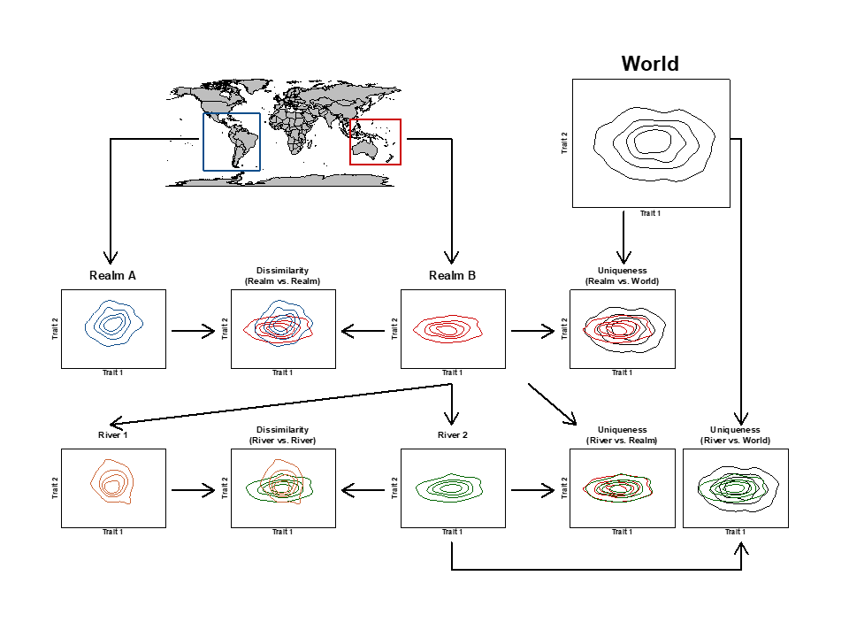
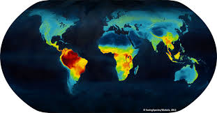
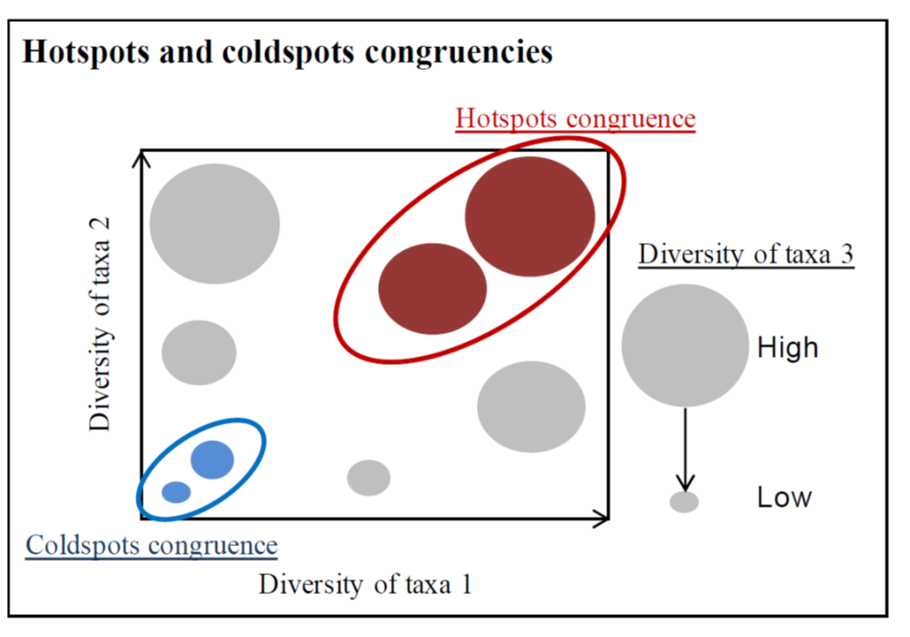
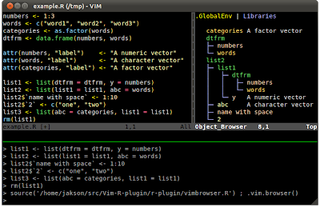

---
---
<link rel="stylesheet" href="styles.css" type="text/css">

 
<h2 align="left"><b>Method comparison</b></h2>
 
  
 
<right> The objective is to compare different approaches to the functional facet of biodiversity and compare how they jointly provide new ways to refine assessments of FD patterns and the effect of human activity. </right>  

 
 
 
 
 
 
 
 
 
 

<h2 align="right"><b>Global Functional Diversity</b></h2>
 
  
 

<left> This project aims to gather different databases of functional traits of plants and vertebrates and exploring the macro ecology of functional diversity among taxonomic groups in a context of global change. </left>

 
 
 
 
 
 
 
 
 
 
 
 

<h2 align="left"><b>Cross-taxonomic diversity</b></h2>
  
 
<right> The objective of this project is to study the taxonomic and functional diversities patterns of taxonomic groups representing contrasting ecosystems type and determine their congruence at global and biogeographical realm scales. </right> 
 
 
 
 
 
 
 
 
 
 
 
 
 

<h2 align="right"><b>GIS application for conservation</b></h2>
  
 
<left> The objectives is to evaluate the status of the grassland in Estonia. This project was realized under the supervision of [Dr. Aveliina Helm](https://landscape.ut.ee/people/aveliina-helm/?lang=en). My main task was developing GIS and R algorithms for conservation prioritization maps. I also developed algorithms for [Zonation software](https://www.syke.fi/en-US/Research__Development/Nature/Specialist_work/Zonation_in_Finland/Zonation_software). </left>    
 
 
 
 
 
 
 
 
 
 
 