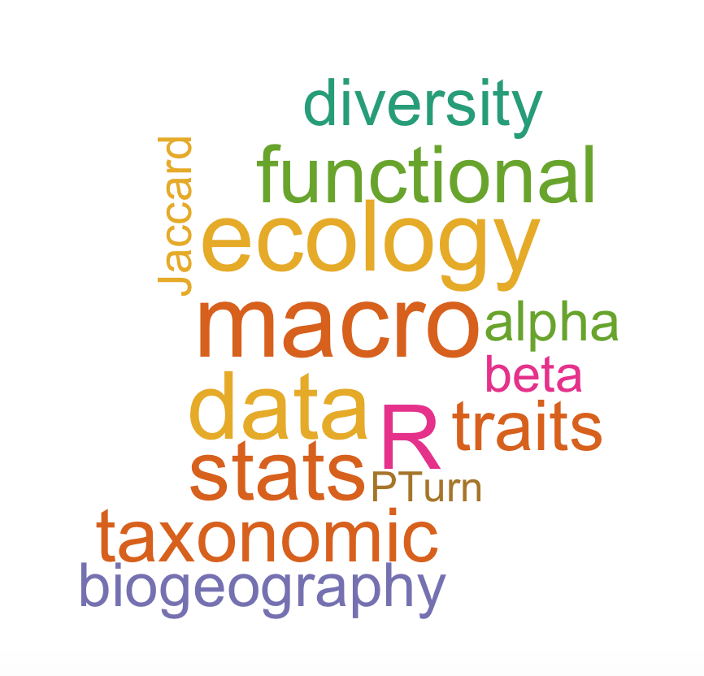

<link rel="stylesheet" href="styles.css" type="text/css">

 

My main research interest is investigating questions related to functional diversity of vertebrates and plants in a context of global change. I am currently a research fellow at the [University of Tartu](https://www.botany.ut.ee/macroecology/en/) in the Macroecology workgroup with [Pr. Meelis Pärtel](https://www.botany.ut.ee/macroecology/en/partel) and [Dr. Carlos P. Carmona](https://www.botany.ut.ee/macroecology/en/carmona). 

I am also involved in different [projects](https://aureletoussaint.github.io/aurele/blogPerso.html).

I graduated from the [University of Toulouse](http://www.univ-tlse3.fr/) with a MS in biostatistics in 2012. In 2012 I started working toward my PhD in macroecology as a PhD-student at [EDB-lab](www.edb.ups-tlse.fr), where I am investigating functional diversity of freshwater fishes at the world scale under the advisement of [Pr. Sébastien Brosse](http://brosse.sebastien.free.fr/) and [Dr. Sébastien Villéger](http://villeger.sebastien.free.fr/) 

I am a well-known R enthusiast, including performing high levels graphics and data mining.

<h2 align="left"><b>Professional address</b></h2>
Institute of Ecology and Earth Sciences  
University of Tartu  
Estonia  

Email:toussaint.aurele@ut.ee  

<h2 align="left"><b>PhD/Post-doc offers</b></h2>

If you are interesting by Macroecology, Functional Diversity, Threatened species, contact us.

 
 
<h1 align="center"><b>Curriculum Vitae</b></h1>

**ORCID** [0000-0002-5738-4637](https://orcid.org/0000-0002-5738-4637) 

<h3 align="left"><b>Current position</b></h3>

**Research Fellow** supported by *the Estonian Research Concil (PSG-505)* [here](https://app.dimensions.ai/details/grant/grant.8855456)

Full CV available [here](data/CV_Toussaint.pdf) 
Mendeley [here](https://www.mendeley.com/profiles/aurele-toussaint/) 
ResearchGate [here](https://www.researchgate.net/profile/Aurele_Toussaint) 

<h3 align="left"><b>Previous grants</b></h3>

**Post-doctoral Fellow** supported by *the Estonian Research Concil (MOBJD-276)* [here](https://app.dimensions.ai/details/grant/grant.7070239)

**Erasmus MUNDUS** with the [Kyung Hee University](https://www.khu.ac.kr/eng/main/index.do), Seoul (Korea)

<h1 align="center"><b>Publications</b></h1>

The below publications represent my work to date. A full list of publications is available in [Google scholar](https://scholar.google.fr/citations?user=oTxWHKgAAAAJ&hl=fr) and [ResearchGate](https://www.researchgate.net/profile/Aurele_Toussaint).

## 2020

Carmona C.P., Tamme R., Partel M., de Bello F., Brosse S., Capdevila P., Gonzalez-M R., Gonzalez-Suarez M., Salguero-Gomez R., Vasquez-Valderrama M., **Toussaint A.**, Mapping extinction risk in the global functional spectra across the tree of life, *bioRxiv*, doi: https://doi.org/10.1101/2020.06.29.179143  [pdf](https://www.biorxiv.org/content/10.1101/2020.06.29.179143v1.abstract)

Derezal, O., Mondy P.C., Dembski S., Kreutzenberger K., Reyjol Y., Chanderis A., Valette L., Brosse S., **Toussaint A.**, Beillard J., Merg M.L., Usseglio-Polatera P., A diagnostic-based approach to assess specific risks of river degradation in a multiple pressure context: Insights from fish communities. *Science of The Total Environment*, 734, 139467 [pdf](data/2020_Derezal_et_al_STOTEN.pdf)

**Toussaint A.**, Bueno C.G., Davison J., Moora M., Tedersoo L., Zobel M., Opik M. & Partel M., Asymmetric patterns of global diversity among plants and mycorrhizal fungi *Journal of Vegetation Science*, 31(2), 355-366 [pdf](data/2019_Toussaint_JVS.pdf)

## 2018

**Toussaint A.**, Charpin N., Beauchard O., Grenouillet G., Oberdorff T., Tedesco P.A., Villéger S. & Brosse S. Non-native species led to marked shifts in functional diversity of the world freshwater fish faunas. *Ecology Letters*, 21(11), 1649-1659. [pdf](data/2018_Toussaint_Ecolet.pdf), [press release CNRS](http://www.cnrs.fr/inee/communication/breves/b405.html), [press release IRD](http://www.ird.fr/toute-l-actualite/actualites-scientifiques/la-biodiversite-des-poissons-d-eau-douce-bouleversee) in french and [blog](https://ecolchange.wordpress.com/2018/10/11/new-publication-non-native-species-led-to-marked-shifts-in-functional-diversity-of-the-world-freshwater-fish-faunas/) in English. [Supplementary](data/ele13141-sup-0001-suppinfo.docx)

Kuczynski L., Côte J., **Toussaint A.**, Brosse S., Buisson L., Grenouillet G. Spatial mismatch in morphological, ecological and phylogenetic diversity, in historical and contemporary European freshwater fish faunas. *Ecography*, 41, 1665-1674. [pdf](data/2018_Kuczinski_et_al_Ecography.pdf)

Tedersoo L., Laanisto L., Rahimlou S., **Toussaint A.**, Hallikma T., Pärtel M. Global database of plants with root‐symbiotic nitrogen fixation: Nod DB. *Journal of Vegetation Science*, 29(3), 560-568 [pdf](data/2018_Tedersoo_JVS.pdf)

## 2016

**Toussaint A.**, Charpin N., Brosse S. & Villéger S. Global functional diversity of freshwater fish is concentrated in the Neotropics. *Scientific Report*, 6, 22125. [pdf](data/2016_Toussaint_SciRep.pdf), [press release](http://www.cnrs.fr/inee/communication/breves/b178.html) in french and [radio show](https://www.franceinter.fr/emissions/la-tete-au-carre/la-tete-au-carre-11-avril-2016) (*La tête au carré*, France Inter, 11/04/2016) [Supplementary](data/srep22125-s1.docx)

**Toussaint A.**, Beauchard O., Oberdorff T., Brosse S. & Villeger S. Worldwide freshwater fish homogenization is driven by a few widespread non-native species. *Biological Invasions*, 18, 1295–1304. [pdf](data/2016_Toussaint_BiologicalInvasions.pdf)

## 2015

Allard L., **Toussaint A.**, Vigouroux R. & Brosse S. Length-weight relationship of 58 fish species in streams of French Guiana. *Journal of Applied Ichthyology*, 31, 567-570. [pdf](data/2016_Toussaint_BiologicalInvasions.pdf)

## 2014

**Toussaint A.**, Beauchard O., Oberdorff T., Brosse S., Villéger S. Historical assemblage distinctiveness and the introduction of widespread non-native species explain worldwide changes in freshwater fish taxonomic dissimilarity. *Global Ecology and Biogeography*, 23, 574–584. [pdf](data/2014_Toussaint et al._GEB.pdf) and [press release](https://www.cnrs.fr/occitanie-ouest/CNRS-Hebdo/Actualites/18686/Suite.aspx) [Supplementary1](data/geb12141-sup-0001-si.doc); [Supplementary2](data/geb12141-sup-0002-si.doc)

<h1 align="center"><b>Communication</b></h1>

2020 Annual meeting for macroecology of the ecological society of Germany Austria and Switzerland, Konstanz, Germany: *Mapping extinction risk in the global functional spectra across the tree of life*

2018 Annual meeting for macroecology of the ecological society of Germany Austria and Switzerland, Birmendorf, Switzerland: *Global mismatch between the species richness of vascular plants and symbiosis fungi*

2017 60th IAVS Annual Symposium, Palermo, Italy: *Global mismatch between the species richness of vascular plants and symbiosis fungi across biogeographic realms*

2016 7th EAFES International Congress, Daegu, South-Korea: *Functional diversity and vulnerability of freshwater fish at the global scale*

2015 9th Symposium for European freshwater sciences, Geneva, Switzerland: *Introductions of non-natives freshwater fish affected differently the taxonomic and functional biodiversity facets*

2015 7th Biennal conference of the International Biogeography Society, Bayreuth, Germany : *Functional diversity of the freshwater fish fauna* (poster)

2013 8th Symposium for European freshwater sciences, Munster, Germany: *Historical assemblage distinctiveness and the introduction of widespread non-native species explain worldwide changes in freshwater fish taxonomic dissimilarity*

<h1 align="center"><b>PhD Thesis</b></h1>

During my PhD, I investigated functional diversity of freshwater fishes at the world scale under the advisement of [Pr. Sébastien Brosse](http://brosse.sebastien.free.fr) and [Dr. Sébastien Villéger](http://villeger.sebastien.free.fr/).

**Toussaint A.** 2016. Diversité fonctionnelle des poissons d'eau douce à l'échelle mondiale: patrons, déterminants et impacts des activité humaines. Université de Toulouse. 223p. [pdf](data/Toussaint_2016_These.pdf)  (in french only) 

## Detailed thesis abstract in English

Biodiversity is often characterized only through its taxonomic facet, i.e. the number and list of species
present in assemblages. However, recent studies show that biodiversity can not be summarized only by
this facet because it does not reflect the ecological characteristics of the species. Several facets can
describe biodiversity as functional diversity that allows considering the ecological traits of species and
thus their role in ecosystem functioning. However, few studies have described this facet of biodiversity
at large scale, its links with the taxonomic diversity and its responses to global change.
The objectives of this thesis is to 1) describe and understand the distribution of the functional diversity
of freshwater fish assemblages at the global scale and 2) quantify the consequences of human activities
on both taxonomic and functional biodiversity facets. Towards these aims we have built a morphological
traits database for more than 9,000 species of freshwater fish occurring in more than 1,000 river basins
across the world.
We have demonstrated that functional diversity is unequally distributed across the world and weakly
related to the taxonomic diversity at global scale. For example, species-rich Neotropical rivers host more
than 75% of the global functional diversity whereas the African or Asian rivers, also rich in species, host
less than a quarter of the world functional diversity. Such a situation is explained by the functional
uniqueness supported by some species of Neotropical fish orders that contribute to increase the
functional diversity of this region. The functional diversity of the different biogeographic realms is also
unequally vulnerable to extinction of endangered species, as Europe or North America could lose
between 35% and 45% of their functional diversity, while the Neotropical realm appears less sensitive
with only 10% of its functional diversity supported by vulnerable species.
We also showed that the introduction of non-native species in many river basins across the world have
contributed to profoundly changing the historical patterns of biodiversity. Indeed, species introductions
have promoted a taxonomic homogenization of fish faunas across the world accompanied by a decrease
in the number of unique species in the poorest assemblages. This change is largely due to the overriding
effects of few non-native species largely introduced worldwide. In addition, non-native species have
contributed to significantly increase the functional diversity of assemblages by 150% on average, up to
7 times greater than that reported for taxonomic diversity (20% on average). This demonstrates the high
sensitivity of the functional diversity of fish assemblages face to changes in species composition and the
need to consider the functional diversity for understanding the impact of current and future human
activities.
These results contribute to the knowledge on the biodiversity of the richest vertebrate clade and
therefore have implications in terms of biodiversity conservation and management of freshwater
ecosystems. 